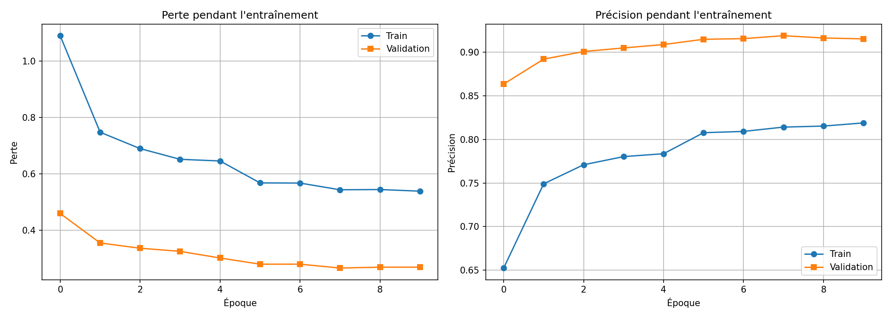
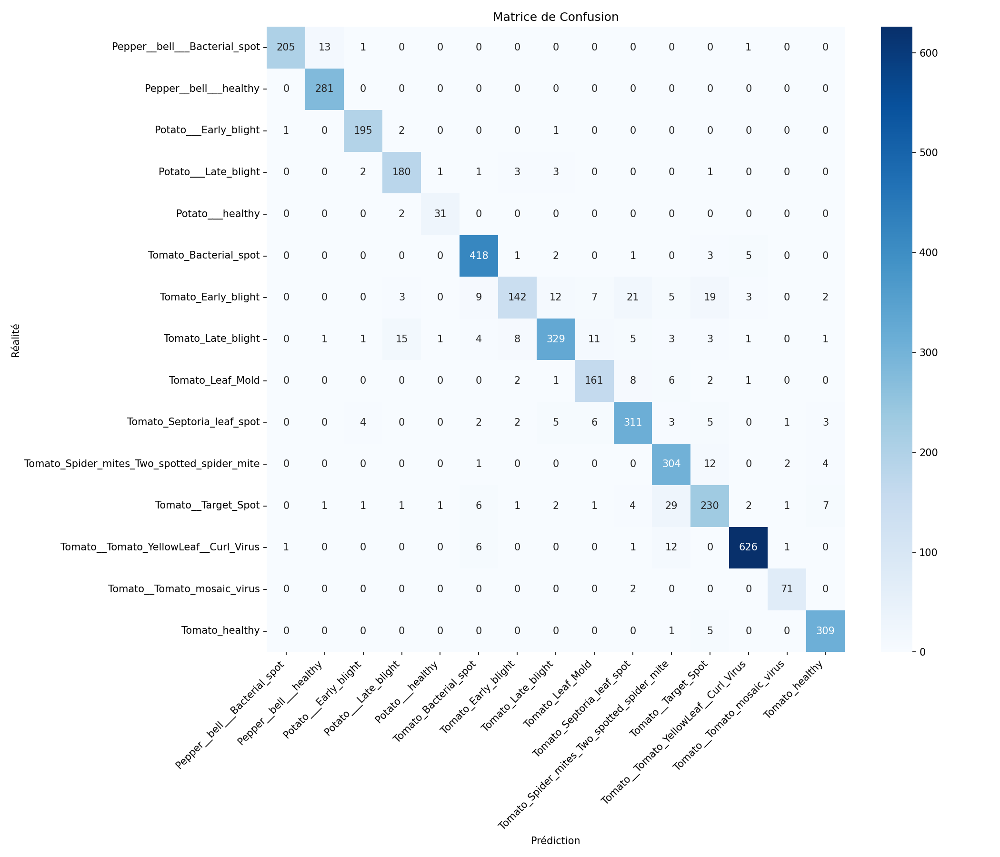

# 🌿 Plant Disease Detection - Tunisian Agriculture

<p align="center">
  
  
  
  
</p>

A deep learning model to detect plant diseases from leaf images using Transfer Learning (ResNet18). Built for Tunisian agriculture to help farmers identify crop diseases early.

## 📋 Table of Contents

- [Features](#-features)
- [Dataset](#-dataset)
- [Installation](#-installation)
- [Training the Model](#-training-the-model)
- [API Usage](#-api-usage)
- [API Endpoints](#-api-endpoints)
- [Results](#-results)
- [Project Structure](#-project-structure)
- [Technologies Used](#-technologies-used)
- [License](#-license)

## ✨ Features

- 🎯 **91.6% Accuracy** on validation set
- 🌱 **15 Disease Classes** for Pepper, Potato, and Tomato
- 🚀 **FastAPI REST API** for easy integration
- 📊 **Swagger UI** for interactive testing
- 🔄 **Transfer Learning** with ResNet18
- 📱 **Ready for deployment** (mobile/web)

## 📊 Dataset

Using the **PlantVillage Dataset** with 15 classes:

| Crop | Classes |
|------|---------|
| 🫑 Pepper | Bacterial Spot, Healthy |
| 🥔 Potato | Early Blight, Late Blight, Healthy |
| 🍅 Tomato | Bacterial Spot, Early Blight, Late Blight, Leaf Mold, Septoria Leaf Spot, Spider Mites, Target Spot, Yellow Leaf Curl Virus, Mosaic Virus, Healthy |

- **Total Images:** ~41,000
- **Training Set:** 80% (~33,000 images)
- **Validation Set:** 20% (~8,000 images)
- **Image Size:** 224x224 pixels

## 🛠 Installation

### Prerequisites

- Python 3.10+ (tested on Python 3.14)
- pip package manager

### Setup

1. **Clone the repository**
```bash
git clone https://github.com/yourusername/plant-disease-detection.git
cd plant-disease-detection
```

2. **Install dependencies**
```bash
pip install torch torchvision numpy pandas matplotlib scikit-learn pillow seaborn
pip install fastapi uvicorn python-multipart
```

3. **Download the dataset**
   - Download PlantVillage dataset and place it in the project folder
   - Or use your own plant disease images

## 🎓 Training the Model

### Using Jupyter Notebook

1. Open `plant_disease_detection.ipynb` in VS Code or Jupyter
2. Run all cells sequentially
3. The trained model will be saved as `plant_disease_model_complete.pth`

### Training Parameters

| Parameter | Value |
|-----------|-------|
| Architecture | ResNet18 (pretrained on ImageNet) |
| Optimizer | Adam |
| Learning Rate | 0.001 |
| Batch Size | 32 |
| Epochs | 10 |
| Image Size | 224x224 |

## 🚀 API Usage

### Start the API Server

```bash
python api.py
```

The server will start at `http://localhost:8000`

### Test with Swagger UI

Open your browser and go to:
```
http://localhost:8000/docs
```

### Test with cURL

```bash
curl -X POST "http://localhost:8000/predict" \
  -H "Content-Type: multipart/form-data" \
  -F "file=@path/to/plant_image.jpg"
```

### Test with Python

```python
import requests

url = "http://localhost:8000/predict"
files = {"file": open("plant_image.jpg", "rb")}
response = requests.post(url, files=files)
print(response.json())
```

## 📡 API Endpoints

| Method | Endpoint | Description |
|--------|----------|-------------|
| GET | `/` | API information |
| GET | `/health` | Health check |
| GET | `/classes` | List all 15 disease classes |
| POST | `/predict` | Upload image for prediction |
| GET | `/docs` | Swagger UI documentation |

### Example Response

```json
{
  "success": true,
  "prediction": "Tomato_Early_blight",
  "confidence": 94.56,
  "top_5_predictions": [
    {"class": "Tomato_Early_blight", "probability": 94.56},
    {"class": "Tomato_Late_blight", "probability": 3.21},
    {"class": "Tomato_Septoria_leaf_spot", "probability": 1.45},
    {"class": "Tomato_Leaf_Mold", "probability": 0.52},
    {"class": "Tomato_healthy", "probability": 0.15}
  ],
  "message": "La plante est probablement: Tomato_Early_blight"
}
```

## 📈 Results

### Training Performance

| Metric | Value |
|--------|-------|
| Training Accuracy | ~95% |
| Validation Accuracy | **91.6%** |
| Training Loss | 0.15 |
| Validation Loss | 0.27 |

### Confusion Matrix

The model shows strong performance across all 15 classes with minimal confusion between similar diseases.




## 📁 Project Structure

```
plant-disease-detection/
│
├── 📓 plant_disease_detection.ipynb  # Training notebook
├── 🐍 api.py                          # FastAPI server
├── 📦 plant_disease_model_complete.pth # Trained model
├── 📦 best_model.pth                  # Best model weights
├── 📊 training_history.png            # Training graphs
├── 📊 confusion_matrix.png            # Confusion matrix
├── 📄 README.md                       # This file
│
└── 📂 PlantVillage/                   # Dataset folder
    ├── Pepper__bell___Bacterial_spot/
    ├── Pepper__bell___healthy/
    ├── Potato___Early_blight/
    ├── Potato___Late_blight/
    ├── Potato___healthy/
    ├── Tomato_Bacterial_spot/
    ├── Tomato_Early_blight/
    ├── Tomato_Late_blight/
    ├── Tomato_Leaf_Mold/
    ├── Tomato_Septoria_leaf_spot/
    ├── Tomato_Spider_mites_Two_spotted_spider_mite/
    ├── Tomato__Target_Spot/
    ├── Tomato__Tomato_YellowLeaf__Curl_Virus/
    ├── Tomato__Tomato_mosaic_virus/
    └── Tomato_healthy/
```

## 🛠 Technologies Used

| Technology | Purpose |
|------------|---------|
|  | Programming Language |
|  | Deep Learning Framework |
|  | REST API |
|  | Interactive Development |
|  | Metrics & Evaluation |

## 🔮 Future Improvements

- [ ] Add more crop types (wheat, olive, citrus)
- [ ] Mobile app with camera integration
- [ ] Real-time disease detection
- [ ] Treatment recommendations
- [ ] Multi-language support (Arabic, French)
- [ ] Edge deployment (Raspberry Pi)

## 👨‍💻 Author

**Your Name**
- GitHub: [@yourusername](https://github.com/yourusername)
- LinkedIn: [Your Name](https://linkedin.com/in/yourprofile)

## 📄 License

This project is licensed under the MIT License - see the [LICENSE](LICENSE) file for details.

## 🙏 Acknowledgments

- [PlantVillage Dataset](https://plantvillage.psu.edu/) for the training data
- PyTorch team for the excellent deep learning framework
- FastAPI for the modern web framework

---

<p align="center">
  Made with ❤️ for Tunisian Agriculture 🇹🇳
</p>
